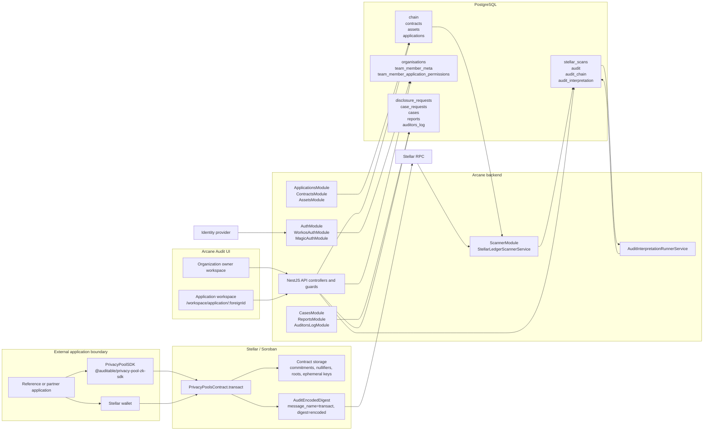

This C4 C2 view shows the deployable/runtime containers and their main data paths.

## C2: Containers

## Container responsibilities

| Container | Implementation | Responsibility |
| --- | --- | --- |
| Reference or partner application | Integrator application | End-user UI, wallet connection, SDK calls, Soroban transaction submission |
| `PrivacyPoolSDK` | `stellar-privacy-layer-contracts/client-sdk` | Coin construction, stealth address helpers, witness construction, proof generation, Soroban serialization |
| Stellar wallet | Wallet integration | Message signing and Soroban transaction signing |
| Soroban contract | `stellar-privacy-layer-contracts/contract/src/lib.rs` | `transact`, proof verification, nullifier checks, commitment state, token transfers, audit event emission |
| Stellar RPC | Configured `chain.rpc_url` | Ledger and event source for registered contract scanning |
| Backend API | NestJS controllers and guards | Authenticated API routes for applications, audit rows, cases, reports, logs, team/admin actions |
| Scanner | `ScannerModule`, `StellarLedgerScannerService` | Ledger range scanning, Soroban event parsing, raw `audit` upsert, `stellar_scans` checkpoint update |
| Interpretation worker | `AuditInterpretationRunnerService` | Decrypt raw audit rows and write normalized `audit_interpretation` records |
| PostgreSQL | TypeORM entities and migrations | Registry, audit, interpretation, access, workflow, report, and activity-log data |
| Audit UI | React/Vite application | Organization and application workspaces backed by `GET /auth/me` and scoped API routes |

## Primary paths

| Path | Sequence |
| --- | --- |
| Private transaction execution | Application -> SDK -> wallet -> `PrivacyPoolsContract.transact` -> contract state + `AuditEncodedDigest` |
| Indexing and interpretation | `AuditEncodedDigest` -> Stellar RPC -> scanner -> `audit` -> interpretation worker -> `audit_interpretation` |
| Portal access | Audit UI -> identity flow -> `GET /auth/me` -> permission buckets -> guarded API routes |
| Disclosure workflow | Case request -> administrator decision -> approved case -> assigned auditor review -> report/activity log |
