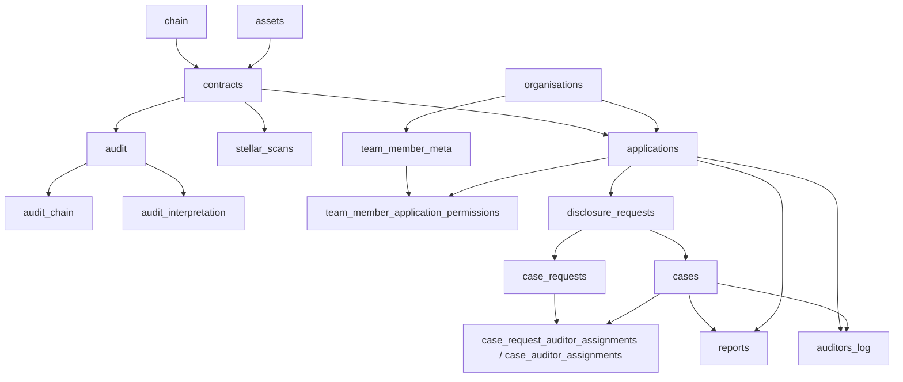
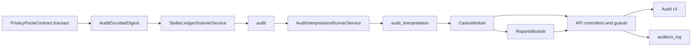

The audit system is the off-chain part of Arcane Compliance. It indexes registered contracts, stores raw and interpreted audit data, enforces access, manages disclosure cases, generates reports, and records activity logs.

## Backend runtime

The backend is a NestJS application with TypeORM and scheduled jobs.

`AppModule` runtime imports:

| Module | Area |
| --- | --- |
| `ConfigModule` | Environment parsing and runtime configuration |
| `ScheduleModule` | Scanner and interpretation intervals |
| `TypeOrmModule` | PostgreSQL connection, entities, migrations |
| `BlockchainModule` | Chain metadata |
| `ContractsModule` | Pool contracts and keys |
| `AssetsModule` | Asset metadata |
| `ApplicationsModule` | Applications and route segments |
| `ScannerModule` | Stellar/Solana scanner providers and scheduled scanner service |
| `AuditModule` | Raw audit rows and audit query endpoint |
| `AuditInterpretationModule` | Interpretation worker and interpreted records |
| `AuthModule` | Auth-me, permissions, guards |
| `WorkosAuthModule` | WorkOS identity implementation |
| `MagicAuthModule` | OTP authentication implementation |
| `AdminsModule` | Organization, team, and access administration |
| `CasesModule` | Case requests, approvals, case review, assignments |
| `ReportsModule` | Report generation, listing, download |
| `AuditorsLogModule` | Activity-log staging, persistence, list, export |

## Storage model

## Tenant and application scope

Every backend request is scoped to one organization from the authenticated session.

Key scope fields:

| Field | Meaning |
| --- | --- |
| `organisations.org_id` | External organization id used by the session |
| `team_member_meta.org_id` | Team member belongs to organization |
| `applications.org_id` | Application belongs to organization |
| `applications.foreign_id` | Stable UI/API route segment |
| `applications.association.contract_id` | Application-to-contract mapping |
| `team_member_application_permissions.application_id` | Application-level access grants |
| `disclosure_requests.application_id` | Disclosure request belongs to application |
| `case_auditor_assignments.application_id` | Case assignment belongs to application |

The backend resolves `/api/applications/:foreignId/...` with `ApplicationScopeGuard`, attaches internal `applicationId` to the request, and uses that id for database queries.

## Workspaces

The Audit UI has two workspace families.

| Workspace | Routes | Backing scope |
| --- | --- | --- |
| Organization owner | `/workspace/organization-owner/overview`, `/applications`, `/team`, `/activity`, `/reports` | `auth/me.owner` permissions |
| Application | `/workspace/application/:foreignId/overview`, `/cases`, `/cases/new`, `/cases/:caseId`, `/disclosure`, `/reports`, `/log`, `/settings` | `auth/me.applications[foreignId]` permission buckets |

Legacy routes under `/workspace/application-auditor/:foreignId/*` and `/workspace/application-administrator/:foreignId/*` redirect to the unified application workspace.

## End-to-end audit pipeline

## API surface

Representative API groups:

| API group | Example route | Main checks |
| --- | --- | --- |
| Auth | `GET /auth/me` | Authenticated identity |
| Applications | `POST /api/applications`, `GET /api/applications` | Owner application permissions |
| Contracts | `POST /api/contracts` | Auth and contract-management checks |
| Audit rows | `GET /api/audit/contract/:contractId` | `reports:view_transactions` |
| Cases | `/api/applications/:foreignId/cases/...` | Application scope, case permissions, assignments |
| Admin case decisions | `/api/applications/:foreignId/case-requests/:id/approve` | `cases:approve_creation` |
| Reports | `/api/reports`, `/api/applications/:foreignId/reports`, `/api/applications/:foreignId/case-reports` | `reports:create`, `reports:list`, `reports:download` |
| Activity log | `/api/auditors-log`, `/api/applications/:foreignId/auditors-log`, `/api/applications/:foreignId/cases/:caseId/auditors-log` | `logs:view_activity` or `reports:view_transactions` |
| Team/admin | `/api/admin/team/...` | Organization owner and team-management checks |

## Permission enforcement

Server-side enforcement uses:

| Mechanism | Purpose |
| --- | --- |
| `WorkosAuthGuard` | Verifies authenticated session/JWT |
| `PermissionsGuard` | Checks required permission keys |
| `ApplicationScopeGuard` | Resolves `:foreignId` and attaches internal `applicationId` |
| `ExternalAuditorScopeGuard` | Restricts external auditor access where used |
| Query-level org/application filters | Prevent cross-organization and cross-application reads |
| Case assignment checks | Restrict case review to assigned auditors |
| Case access-window checks | Enforce `access_days` expiration |

Client-side navigation uses the same permission keys to hide unavailable routes, but API checks are authoritative.

## Activity logging

`AuditorsLogModule` stages log entries during request handling and persists them after successful responses.

Stored fields:

- `event_type`
- `user`
- `org_id`
- `user_id`
- `workos_user_id`
- `object`
- `details`
- `application_foreign_id`
- `case_id`
- `created_at`

Activity lists and CSV exports are available at organization, application, and case boundaries.

## Non-Stellar backend paths

`ScannerModule` and `AuditInterpretationRunnerService` also contain Solana confidential-token scanner and interpretation paths. They share some backend tables and workflow modules after normalization, but they are separate from the Stellar/Soroban privacy-pool contract path described in this architecture section.
