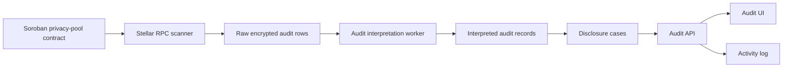

The audit system is the off-chain control plane for selective disclosure of private transaction data. It combines backend services, PostgreSQL storage, scheduled background jobs, an Audit API, and an Audit UI.

## Major subsystems

The backend persists audit data and workflow state in PostgreSQL. Scheduled jobs drive ledger scanning and audit interpretation batches.

| Subsystem | Responsibility |
| --- | --- |
| Enterprise identity boundary | User authentication and organization membership source |
| Auth and permissions | Maps authenticated sessions to organization and application permission buckets |
| Application and contract registry | Stores application records, registered Soroban contracts, and org-scoped contract lists |
| Stellar indexing | Scans configured Stellar ledgers and ingests Soroban privacy-pool events |
| Audit storage | Persists encrypted raw audit rows from indexed chain activity |
| Audit interpretation | Decrypts and normalizes indexed events into disclosure-ready records |
| Disclosure and cases | Disclosure requests, investigation cases, assigned auditors, periods, scopes, and access windows |
| Team and organization admin | Organization bootstrap, team membership, and administrator actions |
| Reports | Transaction summary generation, activity-log exports, scoped report listing, and downloads |
| Activity log | Compliance trail at organization, application, and case scope |
| Audit API | HTTP surface that exposes backend capabilities to the Audit UI |
| Audit UI | Organization owner, application administrator, and auditor workspaces |

## Tenant model

Every query is scoped to an organization.

- **Organizations** own team members, applications, contracts, and org-level activity.
- **Applications** group one or more registered privacy-pool contracts under an organization.
- **Contracts** define the on-chain event sources that indexers scan and classify.
- **Cases** bind disclosure scope to a specific application, investigation period, access window, and assigned auditors.

An organization owner registers applications and manages team access. Application workspaces expose case review, disclosure requests, reports, and audit logs to users with the appropriate permission keys.

## Audit UI workspaces

The Audit UI resolves workspaces from the authenticated session:

| Workspace | Route prefix | Primary users |
| --- | --- | --- |
| Organization owner | `/workspace/organization-owner/*` | Organization owners |
| Application | `/workspace/application/:applicationId/*` | Application administrators and auditors |

Organization owner navigation includes Overview, Applications, Team, Audit Log, and Reports.

Application workspace navigation includes Overview, Case Review, Disclosure Requests, Reports, Audit Log, and Settings. Navigation items are filtered by permission keys.

## End-to-end pipeline

1. **Chain events**: Soroban privacy-pool contracts emit auditable on-chain activity.
2. **Stellar RPC scanner**: The indexer scans ledgers and ingests raw events from registered contracts.
3. **Encrypted audit storage**: Indexed rows persist as encrypted audit payloads and metadata.
4. **Audit interpretation**: A background worker decrypts, validates, and normalizes events into disclosure-ready records.
5. **Interpreted records**: Normalized rows become available for case-scoped queries and analytics.
6. **Disclosure cases**: Approved cases bind users, time period, requested fields, and contract/application scope to interpretation data.
7. **Audit UI**: Organization owners, administrators, and auditors access cases, transactions, reports, and activity logs through the web application.

## Permission enforcement

The Audit API enforces permissions server-side before returning or mutating sensitive data.

Permission checks account for:

- Organization membership
- Application access
- Administrator or auditor role bucket
- Case assignment
- Approved disclosure scope
- Access-window validity
- Report creation, listing, and download permissions
- Activity-log visibility

Client-side navigation uses the same permission shape to hide unavailable routes and actions. API enforcement remains the source of truth.

## Related pages

- [Core components](/architecture/core-components)
- [Data and access flows](/architecture/data-and-access-flows)
- [On-chain indexing](/architecture/on-chain-indexing)
- [Audit events and interpretation](/architecture/audit-events-and-interpretation)
- [Disclosure, cases, and reports](/architecture/disclosure-cases-and-reports)
