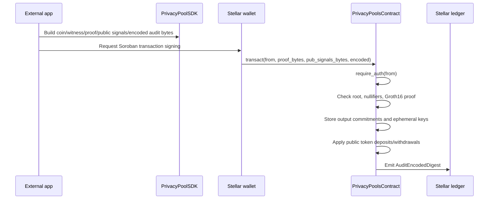
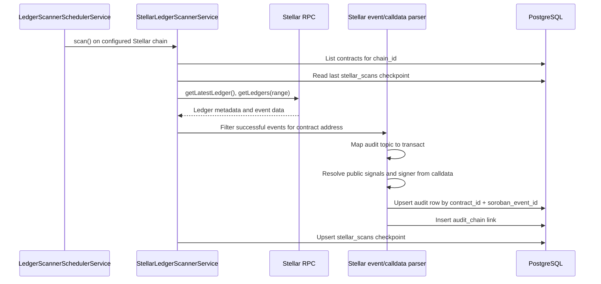
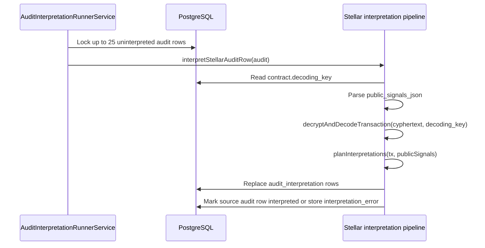
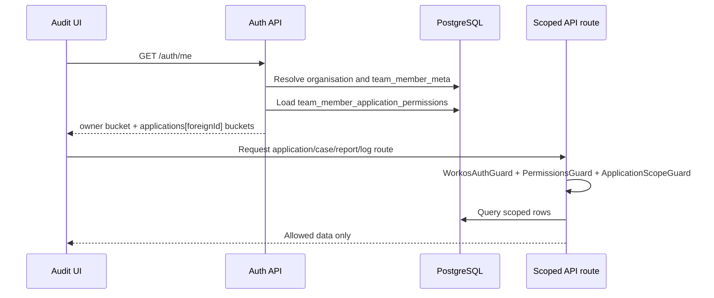
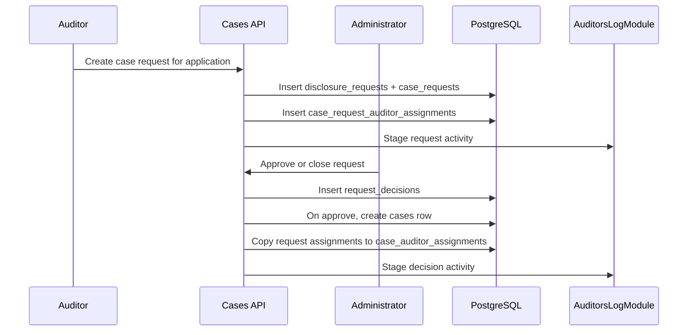
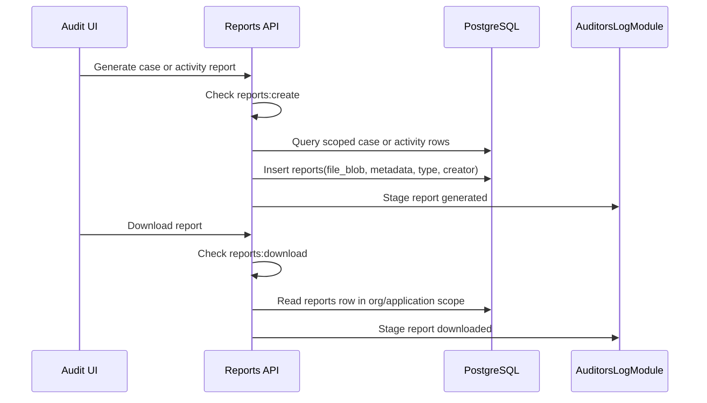

Arcane separates private transaction execution from audit indexing and human disclosure. End users interact with the external application and Soroban contract. Auditors and administrators interact with the Audit UI and API after indexed events are interpreted and scoped by permissions.

## Private transaction flow

`deposit`, `withdraw`, `transfer`, and mixed operations are protocol-level transaction shapes represented inside `transact` inputs. The contract does not expose separate public methods for those operation names.

## Contract state update

Inside `transact`, the contract updates only protocol state:

| State | Storage key or getter | Purpose |
| --- | --- | --- |
| Commitment leaves | `TreeDataKey::Leaf(index)`, `get_commitments` | Public commitment hashes |
| Leaf count | `TreeDataKey::LeafCount`, `get_commitment_count` | Number of stored leaves |
| Leaf ephemeral keys | `TreeDataKey::LeafEphemeral(index)`, `get_leaf_ephemeral` | Recipient-side shared-secret recovery input |
| Merkle root | `TREE_ROOT_KEY`, `get_merkle_root` | Current pool root |
| Merkle frontier | `TreeDataKey::PairwiseFrontier`, `get_pairwise_frontier` | Pairwise LeanIMT insertion state |
| Root history | `RootHistoryKey::Root(i)`, `is_known_root` | 90-root recent history for proof verification |
| Nullifier state | `NulifierDataKey::Nulifier(hash)`, `is_nulifier_hash_consumed` | Double-spend prevention |

## Stellar indexing flow

The scanner only scans registered contracts. Registration comes from `contracts` rows linked to `chain` rows and from `applications.association.contract_id`.

## Raw audit row

The scanner writes one `audit` row per accepted event.

| Column | Source |
| --- | --- |
| `contract_id` | Registered `contracts.id` |
| `tx_id` | Stellar event transaction hash |
| `soroban_event_id` | Stellar event id; unique with `contract_id` |
| `event_type` | `transact` for current `AuditEncodedDigest` events |
| `cyphertext` | Sealed audit payload from the event value |
| `created_at` | Ledger close time |
| `interpreted` | `false` until interpretation succeeds |
| `signer_account` | Signer resolved from `transact` calldata, fallback `unknown` |
| `public_signals_json` | Parsed transaction public signals |
| `interpretation_error` | Last interpretation error, if any |

The scanner also writes `audit_chain` and advances `stellar_scans`.

## Interpretation flow

The runner also routes Solana confidential-token audit rows to the CT interpretation pipeline. The Stellar privacy-pool path uses `interpretStellarAuditRow`.

## Authentication and permission flow

`auth/me` uses `applications.foreign_id` as the key for application-scoped permissions. The UI uses the same value in `/workspace/application/:foreignId` routes.

## Disclosure request flow

`case_requests` defines the case period, access days, disclosure flags, future case id, and optional contract-address filters. `cases` is created only after approval.

## Case review flow

1. The assigned auditor opens `/workspace/application/:foreignId/cases/:caseId`.
2. The API resolves `:foreignId` to internal `application_id`.
3. Guards verify the user is authenticated and has `reports:view_transactions`.
4. Case queries verify organization scope, application scope, active assignment, non-withdrawn request, approved case, and access window.
5. Transaction review reads `audit_interpretation` rows matching the approved period and contract filters.
6. Response shaping applies disclosure flags such as `full_tx_ids`, `sender_information`, and `withdrawal_details`.
7. Access and sensitive actions are recorded in `auditors_log`.

## Report generation flow

Report rows store the generated file as `file_blob`, plus metadata such as boundary, creator, and report type.

## Activity-log flow

`AuditorsLogModule` records platform activity after successful request handling.

| Scope | Storage fields |
| --- | --- |
| Organization | `org_id`, actor fields, object, details |
| Application | Organization fields plus `application_foreign_id` |
| Case | Organization/application fields plus `case_id` |

List and export endpoints apply the same permission model as the UI routes they support.
