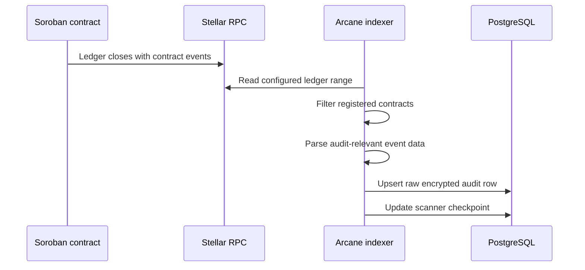
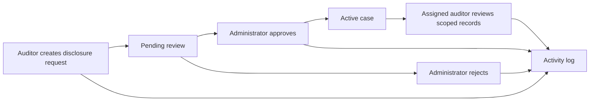

Arcane separates end-user transfer execution, chain ingestion, backend interpretation, human disclosure workflows, and report generation.

## Private transfer flow

1. A user opens a reference application or partner application.
2. The application connects to the user's wallet.
3. The application uses the SDK to prepare a privacy-pool operation.
4. The wallet signs and submits the transaction.
5. The Soroban privacy-pool contract verifies the proof.
6. The contract updates pool state: commitments, nullifiers, roots, or related state.
7. The contract emits audit-relevant events or payload digests.
8. The user transfer completes without going through the Audit UI or disclosure workflow.

## Indexing flow

1. The indexer reads configured ledgers through a Stellar RPC provider.
2. The indexer filters events from registered Soroban privacy-pool contracts.
3. The parser extracts event type, contract reference, transaction reference, and encrypted audit payload or digest.
4. The indexer writes raw encrypted audit rows to PostgreSQL.
5. The indexer updates checkpoints so scanning can resume safely.
6. Failed reads or parse errors are retried or marked for investigation.

## Interpretation flow

1. A scheduled job or worker selects raw encrypted audit rows that are ready for processing.
2. The worker decrypts, resolves, or validates payloads according to the configured key and integration model.
3. The worker normalizes events into disclosure-ready interpreted records.
4. The worker writes interpreted records to PostgreSQL.
5. The worker records interpretation status, errors, and processing metadata.

Interpretation is not disclosure. Interpreted records can exist in the backend, but user access still requires permissions, approved case scope, and audit logging.

## Authentication and permission flow

1. A user opens the Audit UI.
2. The UI authenticates the user through the enterprise identity provider.
3. The Audit API maps the external identity to Arcane organization membership.
4. The permission module resolves workspace access and permission buckets.
5. The API returns only the workspaces, applications, cases, reports, and logs the user is allowed to see.

## Disclosure request flow

1. An auditor creates a disclosure request for a specific application or contract scope.
2. The request includes reason, basis, investigation period, requested fields, access window, and assigned auditors.
3. An application administrator or authorized approver reviews the request.
4. If rejected, the request is closed and logged.
5. If approved, the platform creates an active case.
6. The case grants assigned auditors scoped access to matching interpreted records.
7. Case access expires according to the configured access window.
8. Request creation, approval, rejection, case access, and later changes are written to the activity log.

## Case review flow

1. An assigned auditor opens the case workspace.
2. The Audit API verifies case assignment, application scope, permission keys, and access-window validity.
3. The API queries interpreted records matching the approved period and disclosure scope.
4. The UI shows only fields allowed by the case scope.
5. The platform logs case access and relevant review actions.

## Report generation flow

1. An authorized user requests a report for an organization, application, or case boundary.
2. The API checks report permissions.
3. The report service queries only scoped records.
4. The report service generates a transaction summary, activity-log export, or case export.
5. Report metadata is persisted.
6. Downloads require a separate permission check.
7. Generation and download are written to the activity log.

## Admin and team-management flow

1. An organization owner or admin opens the organization workspace.
2. The API verifies organization ownership or admin permissions.
3. The admin manages team membership, applications, or permission buckets.
4. The system writes all material changes to the activity log.

## Contract registration flow

1. An organization owner or application admin registers an application.
2. The application is bound to one or more contract addresses or privacy-pool identifiers.
3. The chain indexer uses the registry to know which contracts to scan and how to classify events.
4. Indexed events are mapped back to the correct organization/application context.
5. Disclosure cases operate against this application/contract boundary.

## Trust and data-boundary model

The architecture distinguishes:

- Public on-chain data: commitments, nullifier hashes, roots, event envelopes, and contract metadata
- Encrypted audit data: raw payloads indexed into storage
- Backend-interpreted data: normalized records created by the interpretation worker
- User-disclosed data: fields exposed through approved cases and reports
- Activity evidence: logs showing who requested, approved, accessed, generated, or downloaded sensitive data

These boundaries define where privacy is preserved and where disclosure is controlled.
