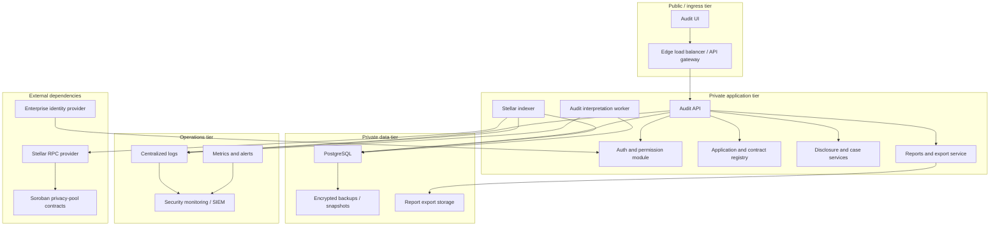

Arcane Compliance is deployed with clear separation between public ingress, private application services, data storage, chain connectivity, identity, and operational monitoring.

The exact cloud provider and managed services can vary by customer environment. The architecture boundaries remain the same.

## Production topology

## Public / ingress tier

The public tier contains only externally reachable entry points.

Components:

- Edge load balancer or API gateway
- Audit UI
- Public endpoint for the Audit API

Controls:

- TLS termination
- Request size limits
- Rate limiting
- WAF or equivalent edge filtering where available
- No direct database access
- No direct access to indexer or worker services
- No direct access to internal storage

The public tier terminates user traffic and forwards valid requests to private application services. It is not a processing boundary for encrypted audit data.

## Private application tier

The private application tier hosts services that enforce business logic and access control.

Components:

- Audit API
- Auth and permission module
- Application and contract registry
- Disclosure request and case services
- Reports and export service
- Stellar indexer
- Audit interpretation worker
- Scheduled jobs

Controls:

- Private network placement
- No direct inbound internet access to workers or indexers
- Service-to-service authentication where supported by the deployment platform
- Environment-based secret injection
- Least-privilege database credentials
- Separate operational roles for API, indexer, worker, and report generation

The Audit API is the only user-facing backend surface. Indexers and workers are backend-only services.

## Private data tier

The private data tier stores workflow state, audit records, interpreted records, reports, and activity evidence.

Components:

- PostgreSQL
- Encrypted database backups
- Optional object storage for report files and exports

Controls:

- No public internet exposure
- Encryption at rest
- Automated backups and restore testing
- Access restricted to application services
- Separate database roles for runtime services and migrations where supported
- Retention policy aligned with customer compliance requirements

Raw encrypted audit rows and interpreted records are stored separately from activity-log evidence. This preserves the distinction between indexed data, disclosure-ready data, and audit evidence.

## External dependency tier

External dependencies are integration boundaries, not Arcane-owned processing components.

Dependencies:

- Stellar RPC provider
- Enterprise identity provider
- Soroban privacy-pool contracts

Controls:

- Outbound-only connectivity from Arcane services where possible
- Explicit RPC endpoint configuration per environment
- Identity provider metadata and signing-key verification
- Contract registration before indexing
- Monitoring for RPC availability, lag, and parser errors

## Operations tier

The operations tier gives platform operators visibility without bypassing application permissions.

Capabilities:

- Centralized application logs
- Security-relevant activity logs
- Metrics and alerting
- Error tracking
- Audit export monitoring
- Backup and restore monitoring

Operational logs and product activity logs serve different purposes. Operational logs help run the platform. Activity logs provide evidence of user and workflow actions inside Arcane.

## Environment separation

Production, staging, and sandbox environments use separate:

- Databases
- Identity provider configuration
- Stellar network configuration
- Contract registrations
- Secrets
- Report storage
- Activity logs

Test data and production audit data do not share storage. Production integrations use production contract registrations and production identity provider configuration.

## Availability and scaling

Arcane services scale along component boundaries:

| Component | Scaling model |
| --- | --- |
| Audit UI | Static or CDN-backed frontend deployment |
| Audit API | Horizontally scalable stateless service |
| Stellar indexer | Scales by network, contract set, or ledger range |
| Interpretation worker | Scales by bounded batch processing and row locking |
| PostgreSQL | Managed database scaling, read replicas where appropriate, backups, and restore procedures |
| Reports | Background or API-triggered generation with permission-gated downloads |

Indexer and worker scaling preserves idempotency. Reprocessing a ledger range or raw audit row does not create duplicate interpretation records.

## Placement rationale

This deployment model follows four principles:

1. **Single ingress**: External users and applications enter through controlled API/UI endpoints.
2. **Private processing**: Indexers, workers, storage, and interpretation logic are not directly exposed.
3. **Data-tier isolation**: Audit data and reports remain in private storage with explicit access paths.
4. **Evidence preservation**: Sensitive workflow actions are captured in activity logs and can be exported under permission control.

## Production readiness checklist

- Audit API is reachable only through the approved ingress path.
- Database is not publicly reachable.
- Indexer and worker services have no public inbound route.
- Stellar RPC endpoints are configured per environment.
- Contract registrations exist for every indexed privacy-pool contract.
- Identity provider configuration is environment-specific.
- Secrets are injected through the deployment platform, not committed to source control.
- Backups are encrypted and restore-tested.
- Activity logs capture request, approval, access, report generation, and download events.
- Report downloads require a separate permission check.
- Monitoring covers API health, indexer lag, interpretation errors, job failures, and backup status.
