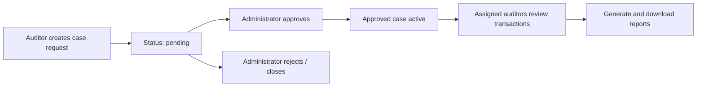

Disclosure workflows let authorized auditors access private transaction data within an approved scope. Administrators approve requests; assigned auditors review transactions, generate reports, and inspect activity logs.

## Core concepts

| Concept | Description |
| --- | --- |
| Disclosure request | Parent record with org, application, reason, status, and approval requirements |
| Case request | Child record with period, access window, disclosure scope flags, and assigned auditors |
| Approved case | Active investigation case created when an administrator approves the request |
| Case auditors | Per-case assignments controlling who can access the case worklist |
| Report | Generated CSV or activity export with boundary metadata |
| Auditors log | Immutable compliance trail of platform actions |

## Lifecycle

1. An auditor submits a case request with basis, reason, period, access window, disclosure scope, and assigned auditors.
2. The request stays **pending** until an application administrator acts.
3. On **approve**, the system creates an approved case with the requested scope.
4. Assigned auditors access transactions within the case period and scope.
5. Auditors or administrators generate reports and review activity logs.

Auditors can **withdraw** pending requests they created. Administrators can **reject** or **close** requests.

## Disclosure scope

Case requests define what data approvers grant:

| Scope field | UI label | Effect |
| --- | --- | --- |
| `full_tx_ids` | Transaction identifiers | Expose full transaction identifiers |
| `sender_information` | Sender information | Reveal sender address data where available |
| `withdrawal_details` / recipient flags | Recipient information | Reveal recipient-side data where available |
| `period_from` / `period_to` | Scope period | Limit transactions to a date range |
| `access_days` | Access window | Time-bound case access from approval |
| `investigation_contract_addresses` | Contract filter | Optional contract address constraints |

The audit UI maps these to disclosure toggles: Transaction Identifiers, Sender Information, and Recipient Information.

## Case auditors

Case-level auditor assignments are separate from organization team membership:

- Request-time assignments copy to case-level assignments on approve
- Administrators with **Case governance — Edit case auditors** (`cases:edit`) can add or remove auditors on an active case
- Removed assignments remain in history (soft-deleted) but are excluded from active queries
- Worklist and case lists filter to cases assigned to the current user

## Reports

Reports are scoped by boundary:

| Boundary | Scope |
| --- | --- |
| Organization | Org-level report list (`GET /api/reports`) |
| Application | Application report list |
| Case | Case tab report generation (`POST .../case-reports`) |

Report types include **Transaction Summary** (CSV from filtered case transactions) and **Activity Log** exports from auditors-log data.

Permissions (labels match the team access form):

- **Reports and logs — Create application reports** (`reports:create`) — generate reports
- **Reports and logs — List application reports** (`reports:list`) — view report lists
- **Reports and logs — Download application reports** (`reports:download`) — download report files

At organization scope, the same keys use **Create organization reports**, **List organization reports**, and **Download organization reports**.

Report generation on case detail routes requires **Reports and logs — Create application reports** (`reports:create`). Workspace-level report pages list existing reports but do not offer generation.

## Auditors log

The auditors log records platform actions after successful handler responses. Each entry includes:

- `event_type`, `user`, `org_id`, `workos_user_id`
- Typed `object` and `details` JSONB (with `type` and `version`)
- Optional `application_foreign_id` and `case_id`

List scopes:

| Scope | Endpoint pattern | Permission |
| --- | --- | --- |
| Organization | `GET /api/auditors-log` | Organization ownership — View organization activity log (`logs:view_activity`) |
| Application | `GET .../applications/:foreignId/auditors-log` | Common access — View activity log (`logs:view_activity`) |
| Case | `GET .../cases/:caseId/auditors-log` | Reports and logs — View transactions (`reports:view_transactions`) |

Events are staged during request handling and persisted only after a successful response.

See [Auditor use cases](/auditor-use-cases/request-disclosure-case) for step-by-step workflows.
