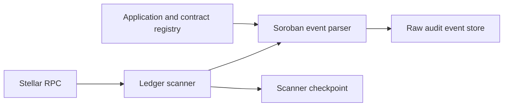

The on-chain indexer is the ingestion boundary between Stellar/Soroban and Arcane. It reads configured ledger ranges, extracts privacy-pool events from registered contracts, and persists encrypted audit rows for later interpretation.

This page covers ingestion only. Interpretation is the next stage.

## Indexer responsibilities

Each Stellar indexer:

1. Connects to a configured Stellar RPC provider.
2. Tracks scan progress with cursors or ledger checkpoints.
3. Reads ledgers in bounded ranges.
4. Extracts Soroban events, transaction metadata, and invoke calldata when required.
5. Filters events from contracts registered to Arcane applications.
6. Persists raw audit rows.
7. Updates scan state after successful ingestion.

The indexer does not grant user access to private data. It only moves chain events into backend storage.

## Stellar ingestion flow

The Stellar ledger scanner:

1. Runs on a scheduled tick.
2. Reads ledgers through Stellar RPC.
3. Parses ledger metadata and transaction processing results.
4. Derives Soroban contract events and relevant invoke calldata.
5. Filters events by registered privacy-pool contract address.
6. Maps events to raw audit rows.
7. Advances scanner checkpoints.



## Contract registration

Indexers scan registered contracts, not arbitrary chain activity.

Registration binds:

- Organization
- Application
- Stellar network
- Soroban contract address
- Optional pool identifier or contract metadata

This binding lets Arcane classify indexed events under the correct organization/application context and later apply case-scoped disclosure rules.

## Stored audit row

Each ingested event becomes a raw audit row.

| Field | Description |
| --- | --- |
| `contract_id` | Registered contract reference |
| `tx_id` | Transaction hash |
| `event_id` | Unique event identifier within the contract/indexing source |
| `event_type` | Event type such as `deposit`, `withdraw`, or `transact` |
| `cyphertext` | Encrypted audit payload |
| `signer_account` | Transaction signer when available from metadata |
| `public_signals_json` | Public proof signals when applicable |
| `interpreted` | Whether interpretation has completed |
| `interpretation_error` | Error captured by the interpretation worker |

Raw audit rows remain encrypted and chain-specific until interpretation runs.

## Checkpointing and retries

The scanner maintains checkpoint state so ingestion can resume safely after restarts or transient RPC failures.

Operational rules:

- Advance checkpoints only after successful event persistence.
- Treat parser errors as observable ingestion failures.
- Retry transient RPC failures.
- Keep failed or uninterpreted rows visible to backend status and logs.
- Use idempotent writes for event rows so rescans do not duplicate audit records.

## Scaling model

```
                    ┌────────────────────────┐
                    │ Arcane audit backend   │
                    └───────────┬────────────┘
                                │
              ┌─────────────────┼─────────────────┐
              ▼                 ▼                 ▼
      Stellar scanner A  Stellar scanner B  Stellar scanner C
              │                 │                 │
              ▼                 ▼                 ▼
       testnet pool 1    mainnet pool 1     mainnet pool 2
```

Multiple scanner instances can cover different networks or contract sets. Contract registrations and scanner configuration define which ledgers and contracts each scanner watches.

## Multi-chain extension point

Other chains require separate chain-specific adapters and parsers. Their events can enter the shared audit storage and disclosure model only after they are normalized into the same raw/interpreted record boundaries.

The Stellar/Soroban privacy-pool scanner is the current architecture described by this documentation section.

## Next stage

After ingestion, rows remain encrypted and chain-specific. The [Audit events and interpretation](/architecture/audit-events-and-interpretation) pipeline decrypts payloads and produces normalized interpretation records for disclosure workflows.
