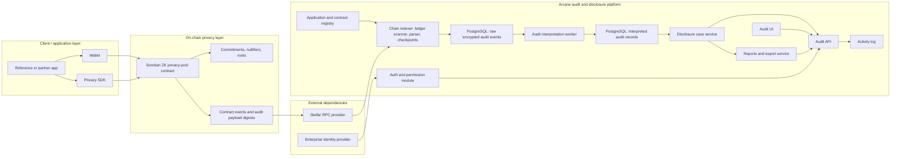

Arcane Compliance on Stellar connects Soroban privacy-pool activity to an off-chain audit and selective-disclosure platform.

The system has two primary runtime domains:

1. **On-chain privacy layer**: Soroban privacy-pool contracts execute private asset operations and emit audit-relevant events.
2. **Off-chain audit and disclosure platform**: Arcane indexes on-chain events, stores encrypted audit records, interprets records for review workflows, enforces permissions, and exposes scoped disclosure through the Audit API and Audit UI.

Reference applications are external clients. They use wallets and the privacy SDK to submit privacy-pool operations to Soroban contracts. They are not part of the Arcane audit platform.

## Architecture map

## Runtime boundaries

| Boundary | Owned by | Responsibility |
| --- | --- | --- |
| Reference or partner app | Application integrator | User-facing deposit, transfer, transact, and withdrawal flows |
| Wallet and SDK | User / application integrator | Signing, private-address handling, local proof generation, and transaction construction |
| Soroban privacy-pool contract | On-chain protocol deployment | Commitments, nullifiers, Merkle roots, proof verification, and event emission |
| Stellar RPC provider | External infrastructure | Ledger and transaction data source for indexers |
| Arcane indexer and workers | Arcane | Event ingestion, checkpointing, encrypted audit storage, and interpretation |
| Arcane API and UI | Arcane | Authentication, permission checks, case workflows, reports, exports, and activity logs |
| Enterprise identity provider | External dependency | User authentication and organization membership source |

## Primary data path

1. A user submits a privacy-pool operation from an application through a wallet and the privacy SDK.
2. The Soroban privacy-pool contract verifies the proof and updates on-chain pool state.
3. The contract emits audit-relevant events or encrypted audit payload digests.
4. The Arcane indexer reads configured ledgers through Stellar RPC.
5. The indexer filters registered contract events and writes raw encrypted audit rows.
6. The interpretation worker converts raw events into normalized interpreted records.
7. Case, report, and review workflows query interpreted records only through scoped API paths.

## Primary access path

1. An auditor or administrator opens the Audit UI.
2. The user authenticates through the enterprise identity provider.
3. The Audit API maps the authenticated identity to Arcane organization and application permissions.
4. The permission module gates every application, case, report, transaction, and activity-log request.
5. Approved disclosure cases grant assigned auditors scoped access to matching interpreted records.
6. Sensitive actions are written to the activity log.

## Data boundaries

Arcane separates raw indexed data, interpreted records, user-disclosed fields, and activity evidence.

| Data class | Examples | Access model |
| --- | --- | --- |
| Public on-chain data | Commitments, nullifier hashes, Merkle roots, event envelopes, contract metadata | Public chain data |
| Encrypted audit data | Raw payloads indexed from registered contract events | Backend processing only |
| Interpreted audit records | Normalized records created by the interpretation worker | API access requires organization, application, permission, case, and scope checks |
| User-disclosed data | Fields exposed through approved cases and reports | Visible only inside approved case/report boundaries |
| Activity evidence | Request, approval, access, report generation, and download events | Permission-gated audit trail |

## Core documentation

<Columns cols={2}>
  <Card title="Core components" icon="diagram-project" href="/architecture/core-components">
    Contracts, indexers, storage, workers, API, UI, and external dependencies.
  </Card>
  <Card title="Deployment model" icon="network-wired" href="/architecture/deployment-model">
    Recommended production placement across ingress, application, data, external dependency, and operations tiers.
  </Card>
  <Card title="Security and compliance model" icon="lock" href="/architecture/security-and-compliance-model">
    Security boundaries, data classes, access controls, disclosure controls, and audit evidence.
  </Card>
  <Card title="Data and access flows" icon="route" href="/architecture/data-and-access-flows">
    Private transfer, indexing, interpretation, disclosure, review, and reporting flows.
  </Card>
  <Card title="Reference applications" icon="mobile" href="/architecture/reference-applications">
    User-facing applications that submit Soroban privacy-pool operations.
  </Card>
  <Card title="Cryptography" icon="key" href="/architecture/cryptography">
    Commitments, nullifiers, private addresses, and client SDK helpers.
  </Card>
  <Card title="Audit system" icon="server" href="/architecture/audit-system">
    Backend control plane, storage, background jobs, and audit UI workspaces.
  </Card>
  <Card title="Identity and access" icon="shield" href="/architecture/identity-and-access">
    Enterprise identity, workspace resolution, permission buckets, and API enforcement.
  </Card>
  <Card title="On-chain indexing" icon="link" href="/architecture/on-chain-indexing">
    Stellar RPC scanners that ingest Soroban events into encrypted audit records.
  </Card>
  <Card title="Disclosure and reports" icon="file-lines" href="/architecture/disclosure-cases-and-reports">
    Cases, scoped disclosure, reports, and activity logs.
  </Card>
</Columns>

## Multi-chain extension point

This architecture page describes the current Stellar/Soroban privacy-pool deployment.

The off-chain audit model can support other privacy rails when their events can be normalized into Arcane audit records. Each additional chain requires its own adapter, event parser, contract or program binding, and privacy assumptions. The disclosure, permission, case, report, and activity-log model remains shared only after that normalization boundary.
