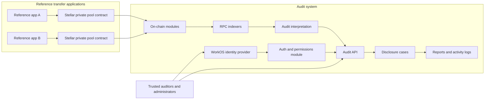

The Arcane Privacy Layer is a privacy-preserving transfer ecosystem with selective audit disclosure. End users transact through private pool applications on Stellar. Trusted auditors and administrators access transaction data only after identity checks, permissions, and approved disclosure scope allow it.

## System map

A deployment can include many reference transfer applications. Each application connects to one or more Stellar private pool contracts. All on-chain activity flows into a shared audit system that indexes events, interprets encrypted payloads, and governs disclosure to authorized users.

## Trust boundary

| Layer | What is private | What auditors see |
| --- | --- | --- |
| On-chain pool | Commitments, nullifier hashes, encrypted audit digests | Nothing by default |
| Audit ingestion | Raw encrypted audit rows in the database | Nothing without permission |
| Disclosure case | Full transaction interpretation | Only fields included in approved scope |

Users transact privately on-chain. Audit users interact with the audit UI and API. They receive scoped access only after an administrator approves a disclosure request and their permission keys allow the action.

## Major components

<Columns cols={2}>
  <Card title="Reference applications" icon="mobile" href="/architecture/reference-applications">
    User-facing private transfer apps backed by Soroban privacy pool contracts.
  </Card>
  <Card title="Cryptography" icon="key" href="/architecture/cryptography">
    Commitments, nullifiers, private addresses, and client SDK helpers.
  </Card>
  <Card title="Audit system" icon="server" href="/architecture/audit-system">
    Backend control plane and audit UI workspaces.
  </Card>
  <Card title="Identity and access" icon="shield" href="/architecture/identity-and-access">
    WorkOS identity, workspaces, and fine-grained permissions.
  </Card>
  <Card title="On-chain indexing" icon="link" href="/architecture/on-chain-indexing">
    RPC indexers that ingest raw blockchain events into audit records.
  </Card>
  <Card title="Audit interpretation" icon="code-branch" href="/architecture/audit-events-and-interpretation">
    Second-phase pipeline that decrypts and normalizes audit events.
  </Card>
  <Card title="Disclosure and reports" icon="file-lines" href="/architecture/disclosure-cases-and-reports">
    Cases, scoped disclosure, reports, and activity logs.
  </Card>
  <Card title="Auditor use cases" icon="user-check" href="/auditor-use-cases/request-disclosure-case">
    Step-by-step workflows for auditors and administrators.
  </Card>
</Columns>

## Data flow summary

1. A reference application submits a private pool transaction on Stellar.
2. On-chain modules scan ledgers and persist encrypted audit rows.
3. The audit interpretation runner decrypts and normalizes events.
4. An auditor creates a disclosure case request with a defined scope.
5. An application administrator approves the request.
6. Assigned auditors review transactions, generate reports, and inspect activity logs within the approved scope.
