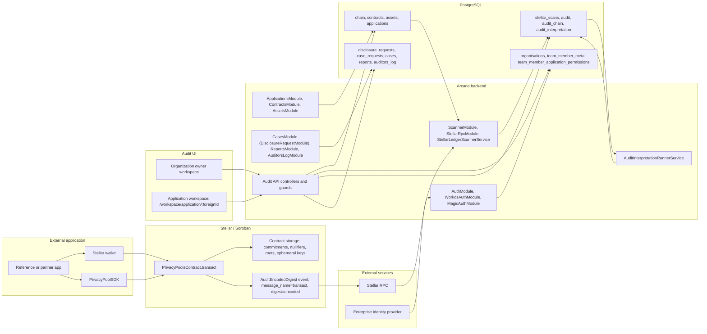

Arcane Compliance connects Stellar/Soroban privacy-pool activity to an off-chain audit, disclosure, reporting, and activity-log system.

This page follows the Stellar privacy-pool path implemented by the Soroban contract, the privacy-pool SDK, the NestJS backend, PostgreSQL, and the Audit UI. The backend also contains Solana confidential-token scanner and interpretation modules; those are separate chain adapters and are not shown in the Stellar/Soroban path below.

## Architecture map

## Runtime boundaries

| Boundary | Implementation | Responsibility |
| --- | --- | --- |
| External application | Reference app or partner integration | Wallet-connected user flow, SDK initialization, proof generation, transaction submission |
| SDK and wallet | `@auditable/privacy-pool-zk-sdk` plus Stellar wallet | Coin generation, stealth address derivation, Merkle witness preparation, Groth16 proof generation, Soroban argument serialization, signing |
| Soroban contract | `PrivacyPoolsContract` | Verify `transact` proof, check recent root, reject reused nullifiers, append output commitments, move public token legs, emit audit digest |
| Stellar RPC | Configured RPC endpoint in `chain.rpc_url` | Ledger, transaction metadata, and Soroban event source for the scanner |
| Backend scanner | `ScannerModule`, `StellarLedgerScannerService` | Scan registered contracts, parse successful Soroban events and `transact` calldata, upsert raw audit rows, update `stellar_scans` checkpoints |
| Backend interpreter | `AuditInterpretationRunnerService` | Decrypt Stellar audit payloads with contract decoding keys and write normalized `audit_interpretation` rows |
| Backend API | NestJS controllers, guards, services | Authenticated organization/application access, case workflows, reports, activity logs, server-side permission checks |
| PostgreSQL | TypeORM entities and migrations | Registry, audit data, interpretation data, users, permissions, cases, reports, logs |
| Audit UI | React/Vite application | Organization owner and application workspaces backed by `GET /auth/me` and scoped API routes |
| Identity provider | WorkOS and Magic Auth modules in this codebase | OAuth/OTP login, organization selection, JWT validation, external user and organization references |

## Stellar privacy-pool data path

1. The application initializes `PrivacyPoolSDK` and connects a Stellar wallet.
2. The SDK prepares coins, Merkle witness data, Groth16 proof bytes, public signal bytes, and encrypted audit bytes.
3. The wallet submits a Soroban invocation to `PrivacyPoolsContract.transact(from, proof_bytes, pub_signals_bytes, encoded)`.
4. The contract calls `from.require_auth()`, validates public signals, checks the proof root against root history, rejects consumed nullifier hashes, verifies the Groth16 proof, stores two output commitments when present, applies public deposit and withdrawal token transfers, and emits `AuditEncodedDigest`.
5. `StellarLedgerScannerService` reads configured ledger ranges through Stellar RPC for contracts stored in `contracts`.
6. The scanner parses successful Soroban events, maps the `audit` topic to `event_type = transact`, extracts public signals and signer data from invoke calldata when available, and upserts a row into `audit`.
7. `AuditInterpretationRunnerService` locks uninterpreted rows, runs the Stellar interpretation pipeline, decrypts `audit.cyphertext` with `contracts.decoding_key`, and replaces rows in `audit_interpretation`.
8. Cases, reports, and transaction review endpoints query interpreted rows only after organization, application, permission, case assignment, disclosure scope, and access-window checks.

## Access path

1. A user opens the Audit UI.
2. The UI authenticates through the backend identity flow and calls `GET /auth/me`.
3. `AuthMeService` resolves the selected organization, owner permissions, and application permission buckets.
4. Application buckets are keyed by `applications.foreign_id`; the UI route is `/workspace/application/:foreignId`.
5. API guards enforce organization membership, application scope, permission keys, case assignment, and access windows.
6. Successful sensitive actions stage and persist `auditors_log` entries with organization, application, case, actor, object, and details fields.

## Data boundaries

| Data class | Stored in | Access model |
| --- | --- | --- |
| Public contract state | Soroban contract storage | Commitments, nullifier hashes, root history, leaf ephemeral keys, token balances, public signals, and event envelopes are public chain data |
| Raw audit data | `audit.cyphertext`, `audit.public_signals_json`, `audit_chain` | Backend processing data; human access goes through interpretation and API checks |
| Interpreted audit data | `audit_interpretation.payload`, `kind`, `amount_stroops` | Queried by case/review/report paths after permission and disclosure-scope checks |
| Registry data | `chain`, `contracts`, `assets`, `applications` | Defines which contracts are scanned and how chain activity maps to organization/application context |
| Access data | `organisations`, `team_member_meta`, `team_member_application_permissions` | Drives `auth/me`, route access, and API permissions |
| Disclosure workflow data | `disclosure_requests`, `case_requests`, `cases`, assignment tables | Defines approved period, fields, contract filters, assigned auditors, and access duration |
| Evidence data | `reports`, `auditors_log` | Downloadable outputs and immutable activity trail, both permission-gated |

## Implementation repositories

| Area | Repository |
| --- | --- |
| Backend, scanner, API, PostgreSQL entities | `stellar-privacy-layer-backend` |
| Audit UI | `stellar-audit-ui` |
| Soroban contract, circuits, SDK | `stellar-privacy-layer-contracts` |

## Core documentation

<Columns cols={2}>
  <Card title="Core components" icon="diagram-project" href="/architecture/core-components">
    Code-level components, backend modules, contract entrypoint, tables, API, and UI.
  </Card>
  <Card title="Data and access flows" icon="route" href="/architecture/data-and-access-flows">
    Transaction, indexing, interpretation, disclosure, review, and reporting flows.
  </Card>
  <Card title="Reference applications" icon="mobile" href="/architecture/reference-applications">
    External applications that use the SDK and wallet to call the Soroban privacy-pool contract.
  </Card>
  <Card title="Cryptography" icon="key" href="/architecture/cryptography">
    Commitments, nullifiers, stealth addresses, and SDK helpers.
  </Card>
  <Card title="Audit system" icon="server" href="/architecture/audit-system">
    Backend modules, storage, scheduled jobs, API, and Audit UI workspaces.
  </Card>
  <Card title="Identity and access" icon="shield" href="/architecture/identity-and-access">
    Identity implementation, `auth/me`, permission buckets, route resolution, and enforcement.
  </Card>
  <Card title="On-chain indexing" icon="link" href="/architecture/on-chain-indexing">
    Stellar RPC scanner, checkpoints, event parsing, raw audit storage, and idempotency.
  </Card>
  <Card title="Disclosure and reports" icon="file-lines" href="/architecture/disclosure-cases-and-reports">
    Disclosure requests, cases, assignments, reports, and activity logs.
  </Card>
</Columns>
