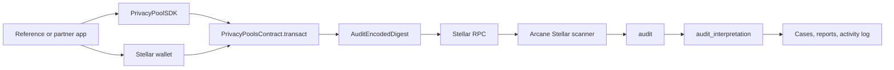

Reference applications are external wallet-connected clients. They are not part of the Arcane audit backend. They use the privacy-pool SDK and a Stellar wallet to submit transactions to the Soroban privacy-pool contract. Arcane indexes the same contract independently through Stellar RPC.

## Boundary

| Area | In the reference or partner app | In Arcane |
| --- | --- | --- |
| End-user UI | Yes | No |
| Stellar wallet connection | Yes | No |
| SDK proof generation | Yes | No |
| Soroban `transact` submission | Yes | No |
| Contract event indexing | No | Yes |
| Audit interpretation | No | Yes |
| Disclosure cases | No | Yes |
| Auditor permissions | No | Yes |
| Reports and activity logs | No | Yes |

## Application responsibilities

An application that integrates the privacy pool does the following:

1. Connects to a Stellar wallet.
2. Initializes `PrivacyPoolSDK`.
3. Derives or accepts a recipient stealth address (`stpl1`).
4. Reads pool state required for Merkle witnesses, such as commitments, root, and leaf ephemeral keys.
5. Constructs private coin data.
6. Generates a Groth16 proof for the `Transaction(20,2,2,1,1)` circuit.
7. Serializes proof bytes and public signal bytes for Soroban.
8. Builds encrypted audit bytes passed as `encoded`.
9. Requests wallet signing and submits `PrivacyPoolsContract.transact`.

The application does not call the Audit API for end-user transfer execution.

## Privacy-pool operation shapes

The contract exposes one transaction entrypoint: `transact`.

Common user-facing operation names map to `transact` inputs:

| User-facing operation | `transact` representation |
| --- | --- |
| Deposit | Public deposit token leg plus one or two private output commitments |
| Withdrawal | Private input commitment spend plus public withdrawal token leg |
| Transfer | Private input commitment spend plus private output commitments |
| Mixed transaction | Combination of private input spends, private output commitments, public deposits, and public withdrawals |

These names are useful for product and SDK flows. They are not separate Soroban methods in the current contract.

## Soroban contract interaction

The application submits:

| Argument | Description |
| --- | --- |
| `from` | Authenticated Stellar address that signs the Soroban transaction |
| `proof_bytes` | Serialized Groth16 proof |
| `pub_signals_bytes` | Serialized public outputs and public inputs |
| `encoded` | Encrypted audit payload bytes emitted later as the audit digest |

The contract handles proof verification, nullifier checks, root checks, commitment insertion, public token transfers, and audit event emission.

## SDK objects

The SDK provides the application-side primitives:

| SDK area | Function examples |
| --- | --- |
| Stealth address derivation | `buildStealthAddressSignMessage`, `generateStealthAddressFromStellarSignature` |
| Coin creation | `generateCoin`, `generateCoinWithSharedSecret`, `generateCoinForDepositWithSharedHex` |
| Witness preparation | `buildWithdrawMerkleWitness` |
| Proof generation | `proveWithdrawal`, `proveTransaction` |
| Soroban serialization | `proofToHex`, `publicToHex` |
| ECDH helpers | `ecdhEphemeralPublicKeyFromScalarHex`, `ecdhSharedKey`, shared-secret helpers |

See [Cryptography](/architecture/cryptography) for commitment formulas, nullifiers, stealth addresses, and SDK setup.

## Relationship to the audit platform

Reference applications and Arcane share the same on-chain contract source of truth. The application writes by submitting Soroban transactions. Arcane reads by scanning registered contract events.
