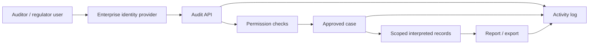

Arcane Compliance is designed for privacy-preserving transaction systems that still require accountable audit workflows.

The architecture separates private user activity from regulated review workflows. End users transact through applications and Soroban privacy-pool contracts. Auditors and administrators access data only through authenticated, permission-checked, case-scoped disclosure paths.

## Security objectives

Arcane's security and compliance model is built around five objectives:

1. **Privacy by default**: On-chain activity does not expose sender, recipient, and amount fields by default.
2. **Controlled disclosure**: Sensitive fields become visible only through approved cases and reports.
3. **Least privilege**: Users receive only the organization, application, case, and action permissions required for their role.
4. **Auditability**: Sensitive workflow actions are recorded as activity evidence.
5. **Operational isolation**: Indexing, interpretation, storage, API, and UI concerns are separated by runtime boundary.

## Trust boundaries

| Boundary | Data handled | Primary controls |
| --- | --- | --- |
| Client application | User transaction intent, wallet interaction, local SDK state | Wallet signature, client-side proof generation, application security controls |
| Soroban privacy-pool contract | Commitments, nullifier hashes, Merkle roots, public event envelopes | On-chain proof verification and double-spend prevention |
| Stellar RPC provider | Public ledger and event data | Read-only chain data source, monitored availability |
| Arcane indexer | Registered contract events and encrypted audit payloads | Contract registry, checkpointing, idempotent ingestion |
| Arcane storage | Raw encrypted audit rows, interpreted records, case data, reports, activity logs | Private data tier, database access controls, backups, retention policy |
| Audit API | Permissioned access to cases, reports, logs, and interpreted records | Authentication, authorization, case scope, activity logging |
| Audit UI | User-facing administration and review workflows | Workspace resolution, permission-aware navigation, API-backed enforcement |
| Enterprise identity provider | User authentication and organization membership | SSO/OIDC, session validation, signing-key verification |

## Data classification

| Data class | Examples | Visibility |
| --- | --- | --- |
| Public on-chain data | Commitments, nullifier hashes, Merkle roots, event envelopes, contract metadata | Visible on Stellar |
| Encrypted audit data | Raw payloads indexed from registered contract events | Backend processing only |
| Interpreted audit records | Normalized transaction records created by the interpretation worker | Hidden until API permission and case scope allow access |
| Disclosed case data | Approved transaction identifiers, sender-side fields, recipient-side fields, period-limited records | Visible only to assigned users within approved scope |
| Report data | Transaction summaries, case exports, activity-log exports | Permission-gated generation and download |
| Activity evidence | Request, approval, access, report generation, download, team, and permission events | Permission-gated audit trail |
| Operational telemetry | Service logs, metrics, job failures, indexer lag, interpretation errors | Operator-facing monitoring data |

## Access-control model

The Audit API enforces access decisions server-side.

Access checks combine:

- Authenticated identity
- Organization membership
- Application permission bucket
- Role or permission key
- Disclosure request status
- Case assignment
- Approved disclosure fields
- Investigation period
- Contract/application scope
- Access-window validity
- Report action permission

The Audit UI uses the same effective permission model to render navigation and actions. UI filtering improves usability but does not replace API enforcement.

## Disclosure-control model

Disclosure is case-scoped.

An approved case defines:

- Application scope
- Contract scope where applicable
- Investigation period
- Requested fields
- Assigned auditors
- Access window
- Approval status

The case boundary controls which interpreted records can be queried and which fields are returned. A user with application access does not automatically receive access to all interpreted records.

## Approval and segregation of duties

Disclosure workflows separate request, approval, and review actions.

Typical controls:

- Auditors create disclosure requests.
- Application administrators or authorized approvers approve or reject requests.
- Assigned auditors review only approved case data.
- Administrators can manage case auditor assignments when permitted.
- Activity logs record request, approval, rejection, withdrawal, assignment, access, report generation, and download events.

This separation supports regulated review workflows where data access requires a documented purpose and approval path.

## Audit evidence

Activity logs are part of the compliance architecture.

Evidence includes:

- Who initiated a disclosure request
- Who approved, rejected, withdrew, or closed a request
- Which case and application were involved
- Which users were assigned to a case
- Who accessed case data
- Who generated a report
- Who downloaded a report
- When the action occurred
- Which organization/application boundary applied

Activity evidence is distinct from operational logs. Activity logs document product-level actions. Operational logs support platform reliability and incident investigation.

## Cryptographic boundary

The privacy-pool protocol protects transaction data through commitments, nullifiers, Merkle inclusion proofs, and zero-knowledge proof verification.

Architecture-level guarantees:

- Commitments represent private pool state without exposing user identity.
- Nullifier hashes prevent double spending without revealing the raw nullifier.
- Proof verification happens on-chain.
- Raw audit payloads remain encrypted until backend interpretation.
- Selective disclosure happens through case and report workflows, not through public chain state.

See [Cryptography](/architecture/cryptography) for protocol details and SDK helpers.

## Operational controls

Production deployments include controls for:

- Environment separation
- Secret management
- Private database placement
- Encrypted backups
- Restore testing
- Job and indexer monitoring
- Interpretation error monitoring
- API health monitoring
- Report storage controls
- Activity-log retention
- Administrative access review

See [Deployment model](/architecture/deployment-model) for network placement and runtime tiers.

## Regulator and auditor access pattern

Regulated access follows a bounded path:

This path keeps full backend interpretation data separate from user-visible disclosure. Auditors receive only the approved subset required for the case.

## Assumptions and limits

The architecture depends on these assumptions:

- Soroban privacy-pool contracts emit the audit-relevant events Arcane is configured to index.
- Contract addresses are registered before events are classified into application scope.
- The identity provider correctly authenticates users and exposes stable organization membership data.
- The deployment platform protects runtime secrets and private network boundaries.
- Database backups and retention policies are configured for the customer environment.
- Legal retention, records-management, and jurisdiction-specific compliance requirements are configured at deployment time.

Arcane provides architecture controls for scoped disclosure and auditability. Certification against a specific government, financial, or data-protection framework depends on the full deployment environment, operating procedures, key management, and customer compliance program.
