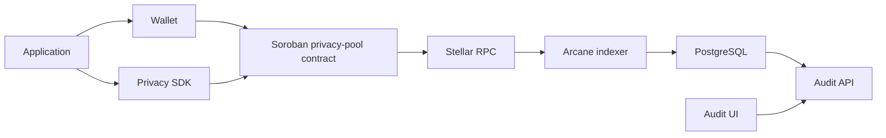

This guide describes how an application connects to the Stellar privacy-pool system and how its on-chain activity becomes available in Arcane Compliance.

An integration has four parts:

1. The application integrates with the wallet and privacy SDK.
2. The application submits privacy-pool operations to Soroban contracts.
3. Arcane registers the application and its contract addresses.
4. Arcane indexes contract events and exposes scoped audit workflows.

## Integration path

Application + wallet + SDK submit privacy-pool operations to Soroban contracts. Arcane indexes registered contract events, stores encrypted audit records, interprets those records, and exposes scoped disclosure through the Audit UI and Audit API.

## Prerequisites

An application integration requires:

- Stellar/Soroban environment
- Deployed privacy-pool contract address
- Access to the client SDK
- Wallet support
- Arcane organization account
- Registered application in Arcane
- RPC provider configuration
- Required environment variables

## On-chain setup

The on-chain setup starts with a deployed Soroban privacy-pool contract.

The contract is responsible for:

- Accepting deposits into the pool
- Supporting private transfer and withdrawal operations
- Maintaining the commitment tree
- Tracking nullifier hashes
- Verifying zero-knowledge proofs
- Emitting audit-relevant events

Arcane only indexes contracts that are registered to an organization/application context.

## Application setup

The application integrates with the privacy-pool SDK and wallet layer.

Application responsibilities:

- Connect to a supported Stellar wallet
- Initialize the privacy SDK
- Generate or accept private addresses
- Construct deposit, transfer, transact, and withdrawal operations
- Generate or attach the required proof data
- Submit transactions to the privacy-pool contract
- Surface transaction status and errors to the user

The application does not manage auditor access or disclosure cases. Those workflows belong to the Arcane audit platform.

## Arcane application registration

Before Arcane can index and classify contract activity, an organization registers the application and its privacy-pool contracts.

Registration includes:

- Creating or selecting the organization
- Creating the application record
- Registering one or more contract addresses or pool identifiers
- Assigning application administrators and auditors
- Confirming that the indexer can read events from the registered contracts

Application-contract binding is the link between on-chain events and case-scoped audit workflows.

## Event indexing

Arcane indexers scan configured chain sources and registered contract addresses.

The indexing pipeline:

1. Reads ledgers from the configured Stellar RPC provider.
2. Filters events from registered privacy-pool contracts.
3. Parses commitments, nullifiers, transaction references, and audit payload data.
4. Writes raw encrypted audit rows to storage.
5. Updates checkpoints so the scanner can resume safely.

Indexer failures are handled through retry and checkpoint state. Failed event parsing or interpretation errors remain visible to operators through backend status and logs.

## Audit interpretation

The interpretation worker converts raw encrypted audit events into normalized records used by case and reporting workflows.

The interpretation pipeline:

1. Reads raw indexed audit rows.
2. Decrypts or resolves audit payloads according to the configured key model.
3. Validates event structure.
4. Normalizes events into interpreted audit records.
5. Marks interpretation status and errors.

Interpreted records are not automatically visible to auditors. User access requires authentication, permission checks, case assignment, approved disclosure scope, and an active access window.

## Identity and permissions

Arcane uses an enterprise identity provider for authentication and maps authenticated users to Arcane organization membership.

Permission scopes include:

- Organization owner access
- Application administrator access
- Auditor access
- Case-level auditor assignment
- Report creation, listing, and download access
- Activity-log access

The Audit API enforces permissions before returning application, case, report, or transaction data.

## Disclosure workflow

Disclosure is case-scoped.

The workflow:

1. An auditor creates a disclosure request.
2. The request includes reason, basis, period, requested fields, access window, and assigned auditors.
3. An application administrator reviews the request.
4. Approved requests create active investigation cases.
5. Assigned auditors can review interpreted records matching the approved scope.
6. Case access expires after the configured access window.
7. Request, approval, access, and report actions are recorded in the activity log.

## Reports and activity logs

Reports are generated from scoped records.

Supported report boundaries:

- Organization
- Application
- Case

Report outputs include transaction summaries and activity-log exports. Report generation and download actions require permission checks and are recorded in the activity log.

## Testing and verification

Use this checklist to verify an integration:

- Contract deployed
- Application can submit a deposit
- Application can submit a private transfer
- Application can submit a withdrawal
- Contract emits expected events
- Indexer ingests events
- Raw encrypted audit rows exist
- Interpretation worker produces records
- Disclosure request can be created
- Administrator can approve the request
- Assigned auditor can view scoped records
- Report can be generated and downloaded
- Activity log records request, approval, access, report generation, and download

## Troubleshooting

Common failures:

- Contract not registered
- RPC provider unavailable
- Indexer checkpoint stuck
- Event parser mismatch
- Raw event exists but interpretation failed
- User authenticated but lacks permission
- User has application permission but is not assigned to the case
- Case access window expired
- Report generation succeeds but download permission is missing
